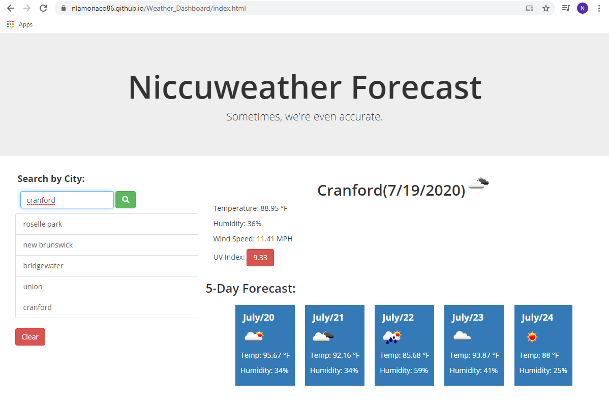

# Weather_Dashboard

Nicholas La Monaco

7/19/2020

Weather Dashboard 

Rutgers Coding Bootcamp Homework

This was solved with a nested function - in future optimization I plan to go back and split the function into more easily managable and efficient code.

https://github.com/nlamonaco86/Weather_Dashboard

https://nlamonaco86.github.io/Weather_Dashboard/index.html

